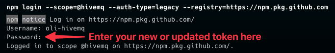

# @hivemq/ui-theme

This package contains the theme for all HiveMQ ChakraUI Projects.

## Importing this library

### Setup .npmrc

To install the theme, you have to add the following line to your `.npmrc` file:

```bash
@hivemq:registry=https://npm.pkg.github.com
```

### Install Peer Dependencies

To install the peer dependencies, use the following command:

```bash
pnpm add @chakra-ui/react @emotion/react @emotion/styled framer-motion
```

### Install CLI tools

Each project has to generate the types for the theme, it cannot be exported by default.
Therefore we have to install the following dependency to our project.

```bash
pnpm add @chakra-ui/cli
```

And also include the generation to our postinstall command

```json
{
  "scripts": {
    "postinstall": "chakra-cli tokens @hivemq/ui-theme"
  }
}
```

### Install Theme

To install a theme, use the following command:

```bash
pnpm add @hivemq/ui-theme
```

### Install Font-Faces

Fonts are not being installed by the theme itself, so you have to install them per project.
For that you can use the following command to install the fonts you want to use in your project.
For example, [Roboto](https://www.npmjs.com/package/@fontsource/roboto) and [Raleway](https://www.npmjs.com/package/@fontsource/raleway) as these are also the default fonts used in the theme.

```bash
pnpm add @fontsource/roboto @fontsource/raleway
```

Then you can import these fonts ether in your `main.ts` file or `global.css` file.

```css
/* Install Roboto for general body text */
@import '../node_modules/@fontsource/roboto/100.css';
@import '../node_modules/@fontsource/roboto/300.css';
@import '../node_modules/@fontsource/roboto/400.css';
@import '../node_modules/@fontsource/roboto/500.css';
@import '../node_modules/@fontsource/roboto/700.css';
@import '../node_modules/@fontsource/roboto/900.css';

/* Install Raleway for heading text */
@import '../node_modules/@fontsource/raleway/100.css';
@import '../node_modules/@fontsource/raleway/200.css';
@import '../node_modules/@fontsource/raleway/300.css';
@import '../node_modules/@fontsource/raleway/400.css';
@import '../node_modules/@fontsource/raleway/500.css';
@import '../node_modules/@fontsource/raleway/600.css';
@import '../node_modules/@fontsource/raleway/700.css';
@import '../node_modules/@fontsource/raleway/800.css';
@import '../node_modules/@fontsource/raleway/900.css';
```

## Troubleshooting

### Unauthorized error
#### Context
You added this library as a dependency to your repository's package.json.

#### Possible Errors
- `error An unexpected error occurred: "https://npm.pkg.github.com/@hivemq%2fui-theme: unauthenticated: User cannot be authenticated with the token provided.".`
- `error An unexpected error occurred: "https://npm.pkg.github.com/download/@hivemq/ui-theme/0.2.0/ca9f1eaf504872aad12d56766542624d511169fa: Request failed \"401 Unauthorized\"".`

#### Resolution - try 1
1. Read the [Generate a new personal token for your GitHub user](https://docs.github.com/en/enterprise-server@3.9/authentication/keeping-your-account-and-data-secure/managing-your-personal-access-tokens#creating-a-personal-access-token) guide
  - Click on [Developer Settings](https://github.com/settings/apps) on GitHub, then on `Personal access tokens`.
  - Choose `Generate new token (classic)`.
  - In the scope, select at least `read:packages`.
  - Remember to copy the generated token before it disappears.
2. Save your new token to an environment variable (e.g. in `~/.bashrc` or `~/.zshrc`):
```bash
export NPM_TOKEN=${YOUR_TOKEN}
```
where `YOUR_TOKEN` is the token you obtained from Github remember to refresh your terminal after adding the it. (e.g. `source ~/.bashrc` depending on your shell)
3. Re-run your repository's installation step (e.g. `yarn install`).

#### Resolution - try 2
If the problem persists, you might need to log in to github.

From your `ui-theme` repo or the one you're importing `ui-theme` from, try to log in with github. Use your github username, and provide the new or updated token as the password:
```shell
npm login --scope=@hivemq --auth-type=legacy --registry=https://npm.pkg.github.com
```



#### If the problem still persists
Check that your user has permissions to access https://github.com/hivemq. You might need to contact an admin to help you out.
